# TuneScout

Search the iTunes catalog, play 30-second previews, and pick up where you left off. TuneScout is a
native Android app written for the Music AI Android code challenge.

[](https://kotlinlang.org/)
[](https://developer.android.com/compose)
[](https://developer.android.com/media/media3)
[](./LICENSE.md)

## 📱 Screenshots

| Splash | Recently played | Search |
| :--: | :--: | :--: |
| 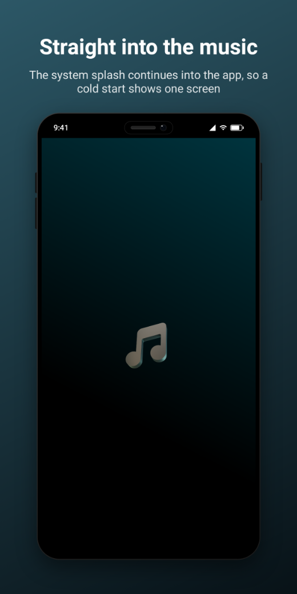 | 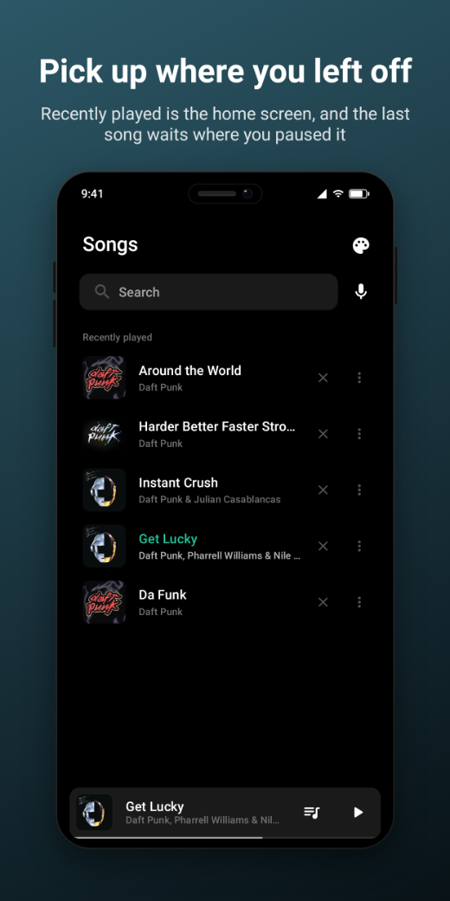 | 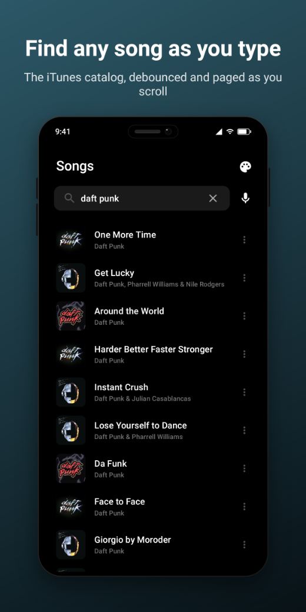 |

| Player | Song options | Album |
| :--: | :--: | :--: |
| 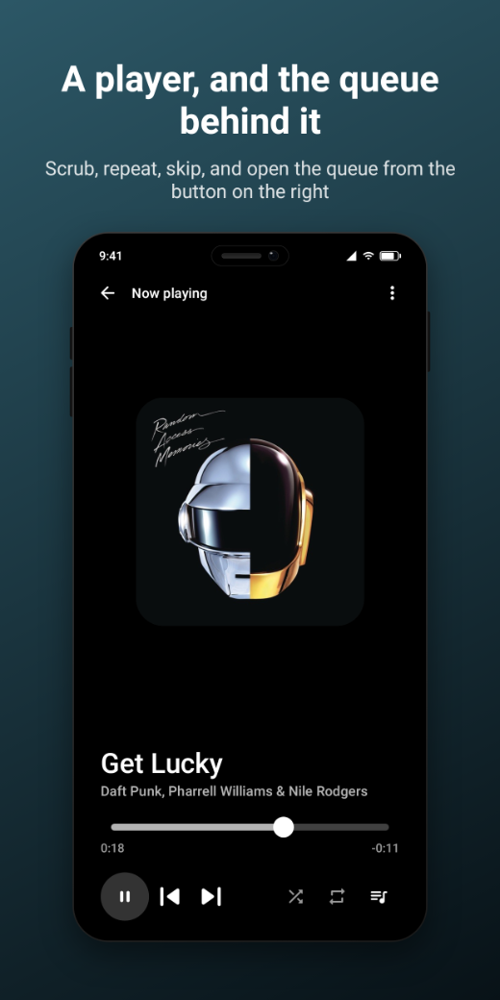 | 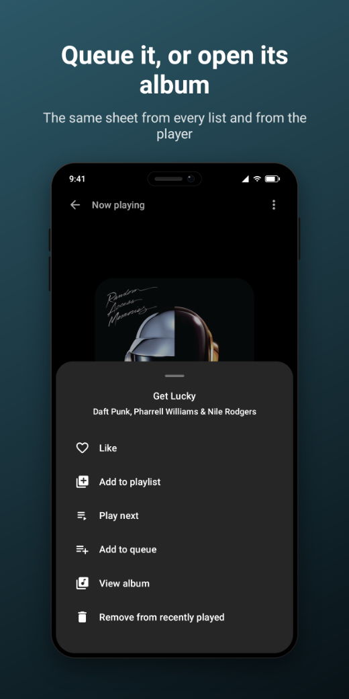 | 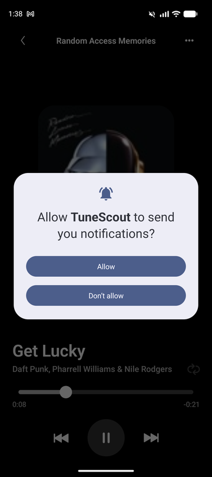 |

| Queue | Theme | Library |
| :--: | :--: | :--: |
| 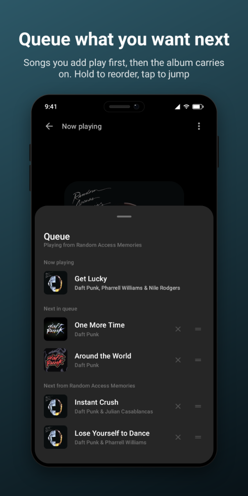 | 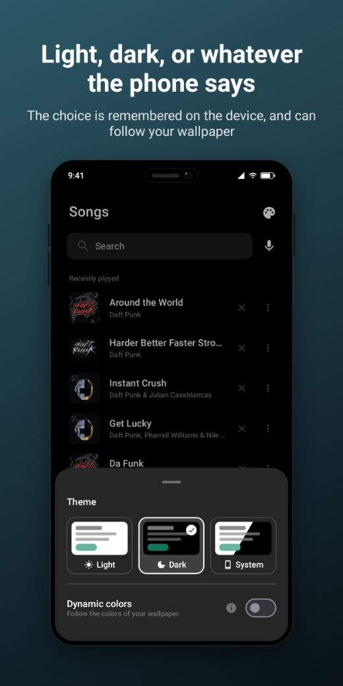 | 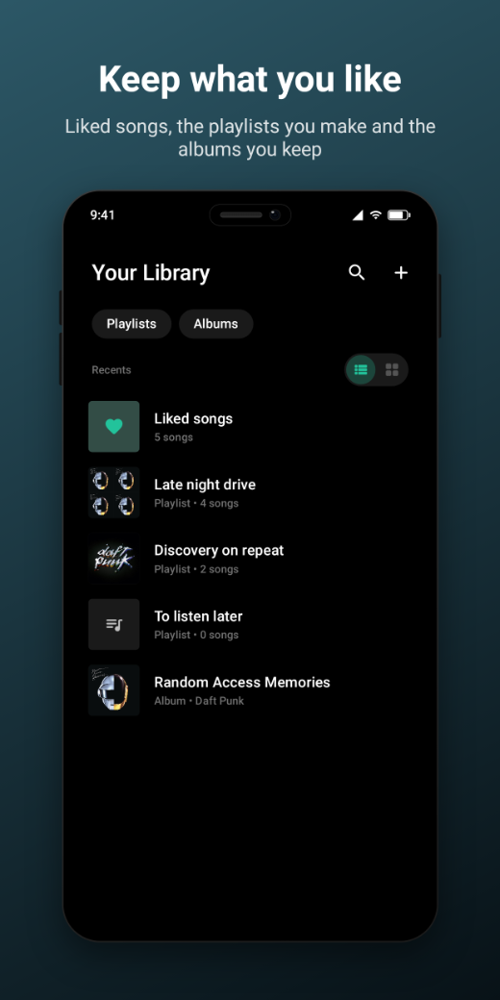 |

| Library as a grid |
| :--: |
| 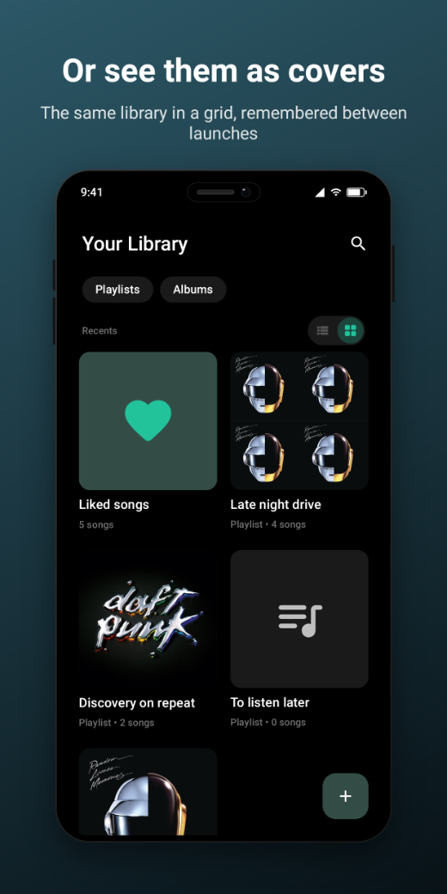 |

### Outside the app

| Lock screen | Lock screen, expanded | Notification shade |
| :--: | :--: | :--: |
| 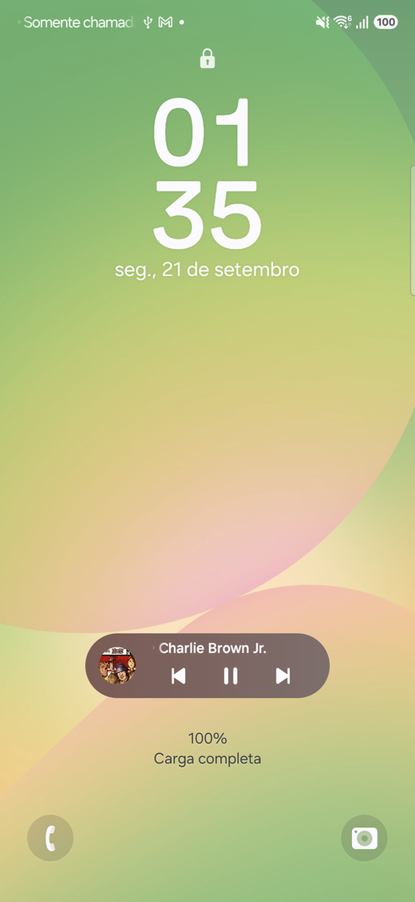 | 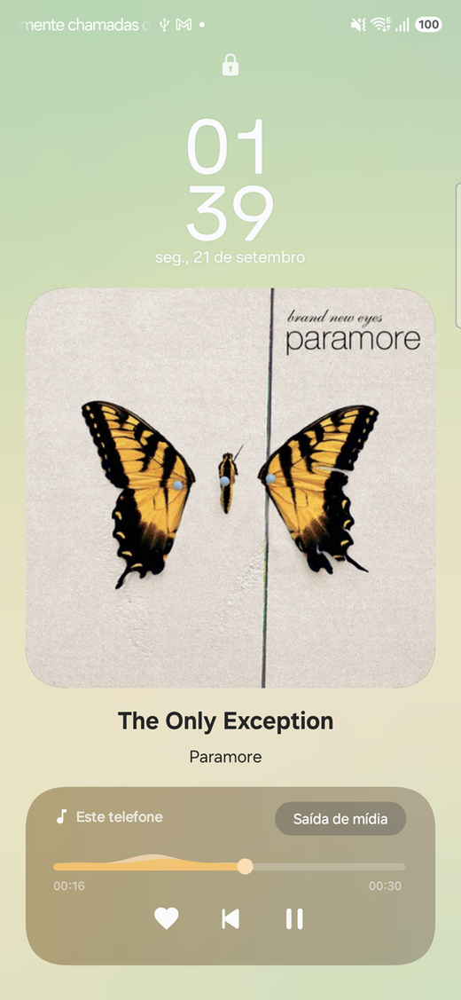 | 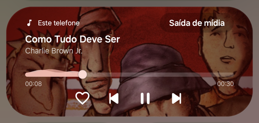 |

| Widget, 4×2: now playing with shortcuts | Widget, 4×1: now playing |
| :--: | :--: |
| 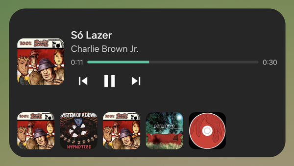 | 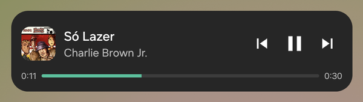 |

The screens inside the app are rendered from its own composables, under Robolectric, by
[`./scripts/screenshots.sh`](docs/screenshots.md); the five outside it are device captures, since
the launcher, the lock screen and the notification shade are not composables.

## ✨ Features

- **Search as you type**, or **by voice**, over the iTunes catalog, paged as you scroll, and
  **play** any preview.
- **A queue like Spotify's**: play next or add to queue, reorder by drag, and what you queued
  survives starting another album.
- **Pick up where you left off**: the queue, the song and its position come back, paused, after the
  app is closed.
- **A library of your own**: liked songs, playlists and liked albums, as a list or a grid.
- **Offline**: previews that played once play again, search answers from what is on the device,
  and every screen says where its rows come from.
- **Outside the app**: two home screen widgets, and media controls on the lock screen and in the
  notification shade.
- **Light, dark or the system's**, with dynamic colour on Android 12+, in English, Brazilian
  Portuguese and Spanish.

Every feature, screen by screen, is in [Features](docs/features.md).

## 🧱 Tech stack

Kotlin · Jetpack Compose · Navigation 3 · Koin · Ktor + kotlinx.serialization · Room 3 ·
DataStore · Paging 3 · Coil 3 · Media3 ExoPlayer · Glance · ktlint with project rules · JUnit 6 ·
Truth · MockK · Turbine

MVVM with unidirectional data flow, one Gradle module per feature, and module dependency rules the
build enforces. See the [Architecture overview](docs/architecture/overview.md).

## 🚀 Getting started

JDK 21 and a device or emulator on API 26+ — no API keys:

```bash
./gradlew :app:installDebug
```

The checks CI runs, and how to run each locally, are in [Getting started](docs/getting-started.md).

## 🚧 Not done

What the app leaves out, on purpose or for lack of time — the typeface, a queue built from a
playlist, backup, and a few more — is listed in [Not done](docs/not-done.md).

## 📚 Documentation

| Document | What's in it |
|---|---|
| [Features](docs/features.md) | Everything the app does, screen by screen. |
| [Getting started](docs/getting-started.md) | Requirements, running the app, and the checks CI runs. |
| [Architecture overview](docs/architecture/overview.md) | Modules, screens, navigation, data, paging, playback and the queue. |
| [Architecture guide](docs/ai_agents.md) | The index every convention hangs off — state, use cases, DI, navigation, data sources, code style. |
| [Decisions and trade-offs](docs/decisions.md) | Why each larger choice was made, and what it costs. |
| [Not done](docs/not-done.md) | What is left out, and why. |
| [Code quality](docs/code-quality.md) | ktlint, the custom ruleset, coverage, and what CI runs. |
| [Continuous integration](docs/ci.md) | Every workflow, when it runs, the Gradle cache, and how to add one. |
| [Testing](docs/testing/README.md) | How the suites are organised and what each layer covers. |
| [README screenshots](docs/screenshots.md) | How the images above are generated, and which ones are captured by hand. |

## 📄 License

TuneScout is open to contributions, but not to commercial use: you may use, copy, modify and share
it, but not sell it or ship it in a commercial product without written permission. See
[LICENSE.md](./LICENSE.md).
